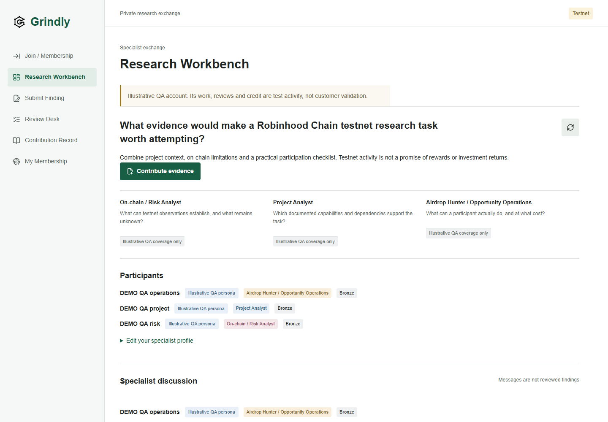
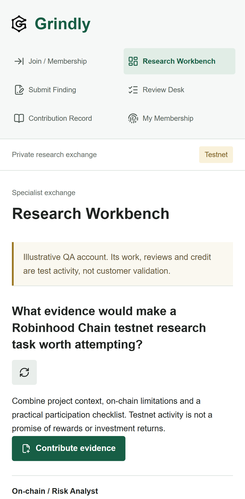

# QA05 Research Collaboration Review

Reviewed 2026-09-25. **BLOCKING for genuine research user testing. Ready for UI annotation and supervised, isolated demo-only usability testing.** No critical defect confirmed; one high and four medium application defects below.

## Checkpoint and Environment

- Actual checkout: `codex/phase-1`, `3f6e252c4a4e3b90d530c17962a72530b895d636`. Verified before testing. Existing untracked branding preserved.
- Production: https://grindly-woad.vercel.app; Vercel inspection resolved READY deployment `dpl_PiMbt2Yq2dzg5pVpMWBzBypV8vrd`, immutable URL https://grindly-8gcmcy9kg-basla1.vercel.app. Manifest executable: `fa031345495725603d4dcbc914fb5078f08683a2`. Git comparison confirmed no application-code difference between executable and checkpoint.
- Local: existing app at http://localhost:3000, hosted Supabase, Robinhood Chain testnet 46630; installed Chrome, Node 22.23.2, pnpm 11.19.0. TLS verification retained with `NODE_USE_SYSTEM_CA=1`.
- Live tests used only the three existing isolated QA personas and their existing tokens. No genuine member writes, role appointments, deployment, minting, NFT transfers, or application-code changes. Added this report, screenshots, and an ignored diagnostic harness. Successful journeys appended labeled synthetic research/credit, not human research evidence.

## Verification Results

| Check | Independent result |
| --- | --- |
| `pnpm check` | PASS: lint, types, 100 unit, 111 embedded database, 11 contract tests, type drift, build |
| Chrome `pnpm test:e2e` | PASS: 38 foundation-mode tests; not authenticated evidence |
| Documented live research config, localhost | PASS: desktop and mobile, 5.8 minutes total |
| Documented live research config, production desktop | PASS: unchanged test on final executable, 2.6 minutes |
| Read-only production correction diagnostic | PASS: three desktop and three mobile navigations; original 20-second field budget retained |
| `git diff --check` | PASS |

Successful findings: production `a57ec3f9-77fa-4f39-82f0-d98e68144739`; local desktop `9c49677b-0da5-44cc-836d-55a5481c7688`; local mobile `14584929-2516-4b60-9a16-54282ab405cd`. Each journey verified persistent discussion attribution, correction v1/v2 history, independent assigned acceptance, three concurrent acceptance retries yielding one 25-XP award, usefulness, and the updated brief.

Embedded checks additionally passed self-approval/scope denial, demo-review isolation, private discussion backlinks/source-count filtering, immutable histories, and rollback on award failure. Hosted read-only checks confirmed all three fixture profiles remain demo-labeled, their roles remain reviewer-only, and the assignment remains `open` / `unfunded`. Payment is never advanced by acceptance in the inspected implementation and database tests.

## Confirmed Application Defects

The following reproductions used actual source/migrations with disposable in-memory fixtures, not attacks on genuine hosted records. Fixes belong to Chat 03; none were implemented here.

1. **High: Demo members can disrupt genuine accepted work.** `supabase/migrations/202609250010_promotion_alias.sql:86` checks visibility but not demo compatibility before the dispute branch at line 92. Reproduction: accept/deliver genuine member-visible work, then dispute as a demo member. Result: `accepted -> disputed`, accepted-brief count becomes zero, assignment becomes `needs_correction`; with no independent replacement reviewer, corrections remain blocked. **Fix:** enforce the actor/author demo boundary before creating disputes or changing any work state; regress the entire rollback/no-change behavior.

2. **Medium: Synthetic usefulness qualifies genuine promotion evidence.** Same migration, lines 88 and 128. Reproduction: genuine candidate has three accepted findings and only a demo persona's cross-specialty use; a genuine independent steward can promote them. Human approval is still required, but the prerequisite accepts synthetic evidence. **Fix:** reject incompatible demo/real usefulness, exclude existing incompatible uses from eligibility, and label demo usefulness wherever displayed. Preserve historical attribution rather than silently deleting it.

3. **Medium: Private lineage leaks an inaccessible version identifier.** `202609250010_promotion_alias.sql:46` checks the submitter's access; `supabase/migrations/202609250007_research.sql:343` returns unredacted version rows. Reproduction: one author links a private Project version from a private Risk finding. A Risk-only reviewer receives the hidden Project `finding_versions.id` through `related_version`, although neither target finding nor target version is visible. **Confirmed leak: identifier/existence metadata, not claim or source contents. Fix:** redact inaccessible lineage targets for each snapshot recipient, or require compatible audiences when linking; test both directions across specialties.

4. **Medium: Revoked reviewer scope leaves a stalled, unreassignable review.** `supabase/migrations/202609250008_research_fixture_boundary.sql:26`. Reproduction: assign R, operator-revoke R's specialty scope, configure qualified K, then invoke steward assignment. The open R assignment prevents replacement; decision authorization correctly denies R. **Fix:** while holding the finding lock, close/audit assignments whose authority is no longer valid, then select a qualified independent replacement. Test scope and role revocation.

5. **Medium: Optional participant tiers block the correction editor.** `src/server/research/service.ts:42`, including the awaited tier lookup at line 60; all views enter through `src/components/research-screen.tsx:35`. Reproduction: defer only a peer's tier promise after the acting member's authentication/ownership and snapshot have succeeded. `readResearch()` remains pending; rejecting that optional promise releases it successfully with `Tier check unavailable`. The editor never displays these peer tiers. **Fix:** omit irrelevant enrichment from editor reads or isolate it from rendering, retaining the acting member's live gate. Add a slow-peer regression and sanitized stage/error diagnostics. This is not proof of the historical timeout's cause.

## Production Failures and Harness Diagnosis

- **Historical RPC failure confirmed, cause unresolved:** Vercel retained POST `/api/research` HTTP 503 at 12:05:33.983 UTC, request `gqrcj-1790337933983-def1f661e15b`, with empty message/logs. The recorded ownership alert identifies the failure path; `src/server/membership/chain.ts:74` collapses transport, wrong-chain and block-consistency failures into the same error. Provider failure cannot be distinguished retrospectively. Submission does not run peer-tier enrichment, so defect 5 does not explain this POST failure.
- **Not reproduced in this review:** the complete production desktop journey passed; eight direct reads through the current ownership implementation succeeded (1.25-1.37 seconds), as did six production token-2 metadata reads (1.31-1.98 seconds). These samples do not prove future provider reliability.
- **Correction timeout not reproduced:** production click-to-field times were desktop 5451/5421/4914 ms and mobile 5432/4916/4378 ms. All six completed without a page error, failure alert or timeout. Recorded RSC cancellations occurred alongside successful navigation and are not classified as outages. Earlier failed runs remain failures; current successes do not establish their cause.
- **Low, harness defect:** `tests/live-research/journey.spec.ts:197` discovers the corrected version's assignment, but line 201 reloads the old reviewer's page. A legitimate reassignment targets the wrong session. Select the context from the new `assignment.reviewer_id`. This happens after correction submission and cannot explain the earlier correction-form timeout. Keep timeout assertions; capture final URL, alert, request ID and response completion on failure.

## Remaining Gaps

- No real human specialist/steward assessment, positive live Silver promotion or peer-request journey was completed. Existing fixtures have no steward role; no appointment was added. Promotion/peer-request predicates have automated coverage, not a complete live human journey.
- Full production mobile mutation journey was not rerun; local mobile mutations and production mobile correction navigation/screenshots passed.
- Wider hosted correction/dispute/delivery/reassignment contention remains untested beyond concurrent acceptance retries. Private-content negative cases and genuine/demo separation used synthetic embedded identities, not genuine hosted writes.
- Genuine reviewer staffing remains an owner decision. Historical ownership/correction failures need sanitized server stage timings and underlying RPC error classification on recurrence; increasing timeouts alone is not a fix.
- Preserve completed Phase 1 transfer-back A. B ownership-driven promotion invalidation/return, C real-inbox/full auth lifecycle, and D concurrent/interrupted/reverted issuance remain deferred. Generated QA OTPs and these research tests do not satisfy them. No new transfer/history-preservation claim is made.
- Conditional hardening, not an active hosted exploit: promotion also lacks a demo/real steward compatibility check (`202609250010_promotion_alias.sql:123`). Existing QA fixtures have no steward role. Enforce that boundary before any such fixture appointment.

## Usability: Three Concrete Problems

1. **Accepted evidence is buried below the entire discussion.** In the current accumulated QA dataset, the brief begins at y=8577 desktop / y=11248 mobile. The coherent three-specialty example competes with repeated test entries. Add a clear jump to accepted evidence and keep accumulated QA history from dominating the first-time demonstration; preserve records and labels.
2. **Mobile navigation dominates the first viewport.** At 412x839, six navigation links, headings and notices push the three specialty explanations below the first screen. Make existing navigation more compact so a newcomer can see the question, specialties and next action sooner. No horizontal overflow was observed.
3. **Correction status points to the wrong next actor.** `src/components/research-views.tsx:644` says `Awaiting an available scoped reviewer` for `needs_correction` after the reviewer completed the decision. The author actually needs to submit a correction. Use status-specific next-action wording and link to the existing correction action.

Specialty labels, author bylines, contribution additions, limitations, demo labels and the unfunded assignment wording are otherwise present and understandable. Genuine user testing should wait for the demo-boundary/privacy fixes and their regressions; UI annotation can proceed now on isolated labeled data.

## Screenshots

Captured from production using the existing demo Project persona; visually inspected for secrets and clipping. CSS viewports: desktop 1440x1000, mobile 412x839. Mobile PNG resolution reflects device pixel ratio. No credentials, OTPs or sessions are included.

[Desktop evidence-brief view](qa05-research/workbench-brief-desktop.png) | [Mobile evidence-brief view](qa05-research/workbench-brief-mobile.png)

Ignored local evidence: `.local/qa05-research/production-original/`, `local-original/`, `navigation-desktop.json`, `navigation-mobile.json`. The diagnostic config/spec are alongside them; they perform fresh fixture authentication and read-only research navigation, with tracing off and no copied sessions.
