# Pilot usability screenshots

Public screenshots below are from the deployed `e23ab56` release on October 8,
2026. They show the existing isolated sample account. Its 125 XP, research,
reviews and historical notifications are not genuine pilot activity.

## Home
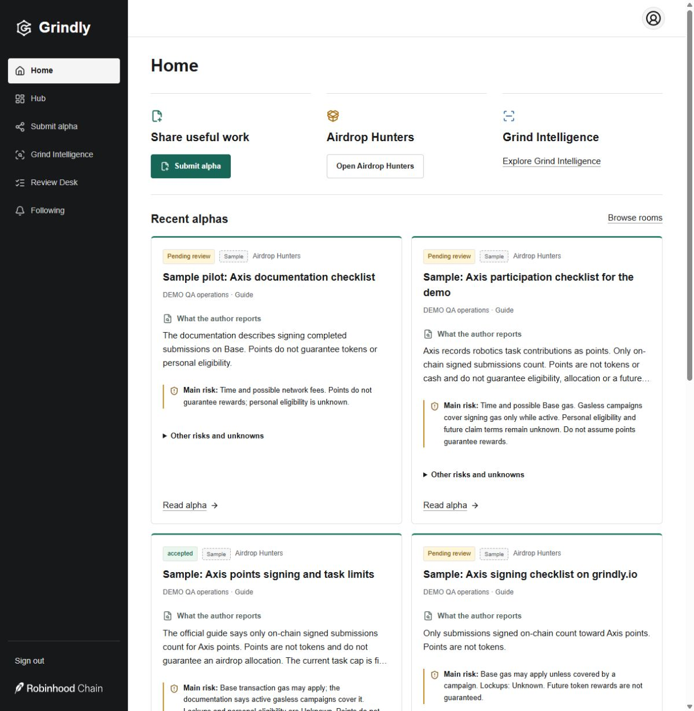

## Alpha
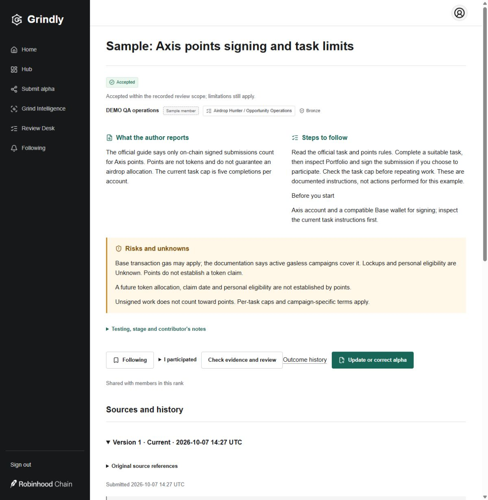

## Intelligence
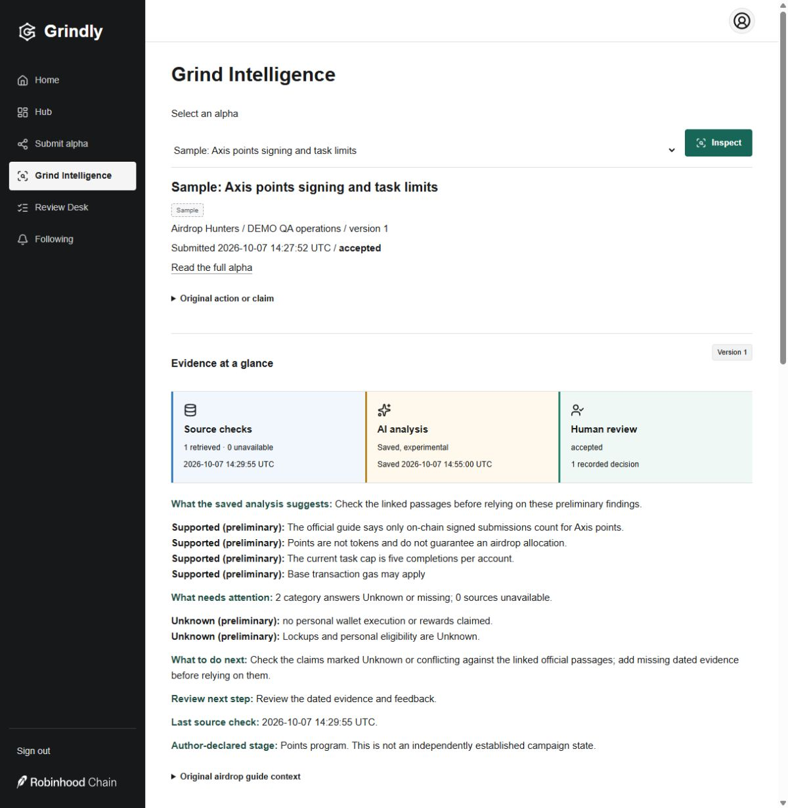

## Hub
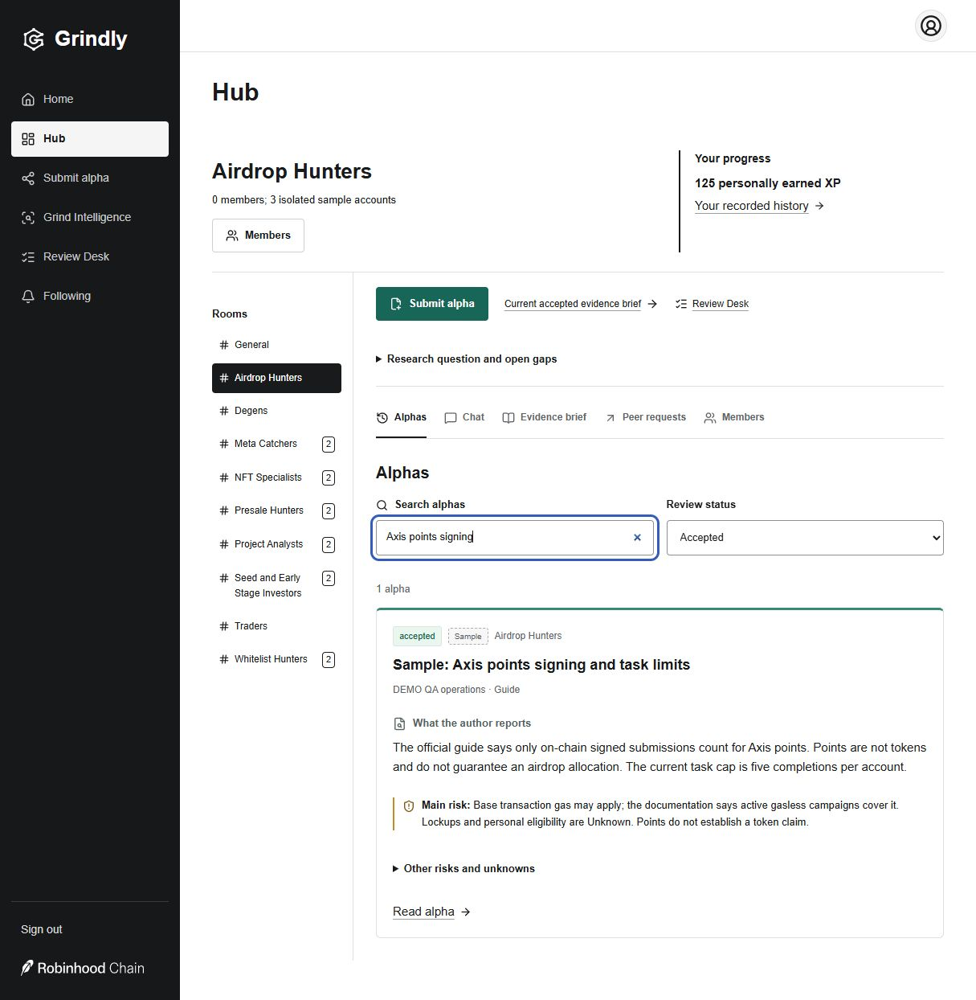

## Submit alpha
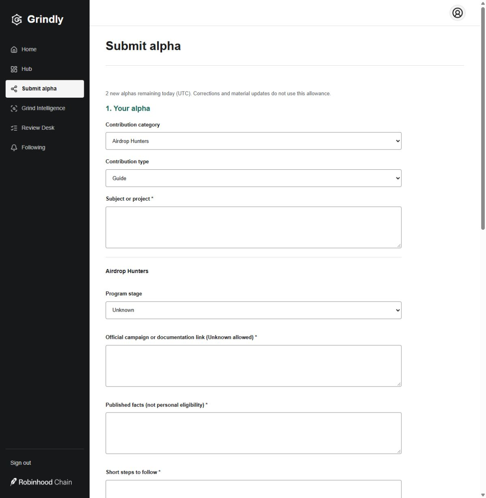

## Review Desk
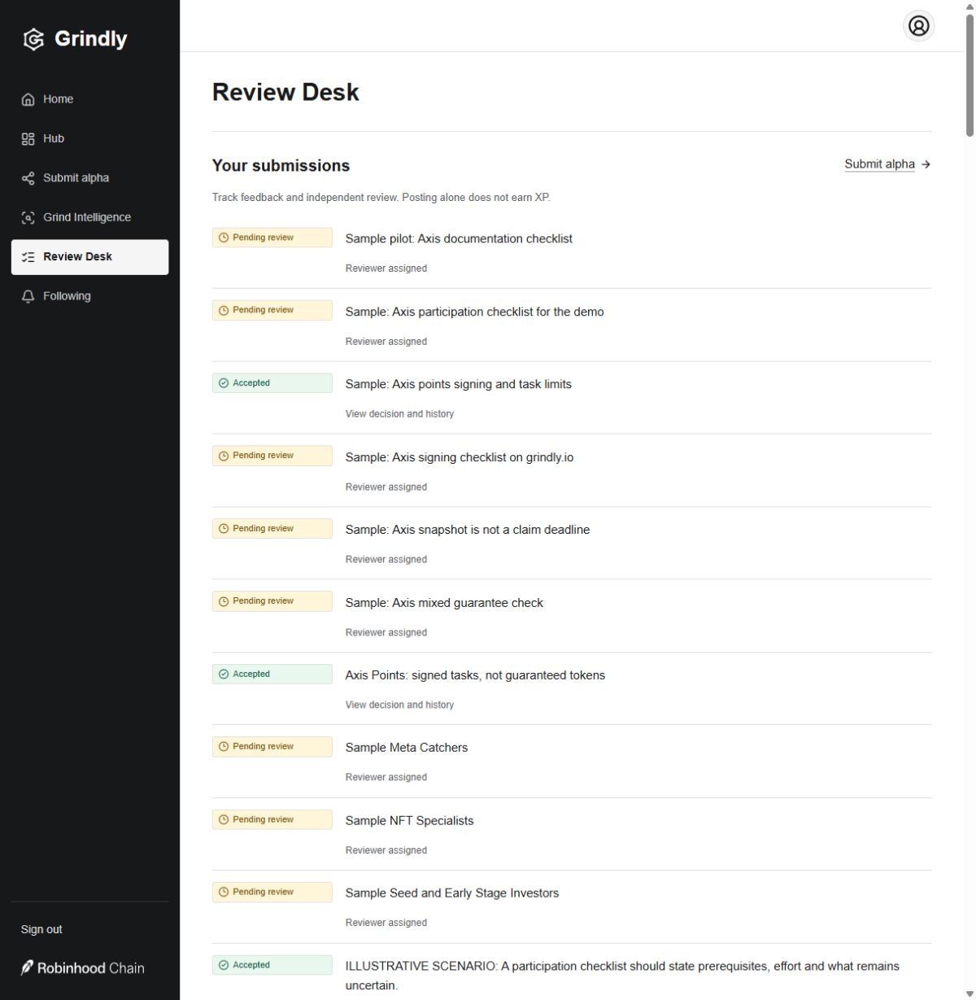

## Profile
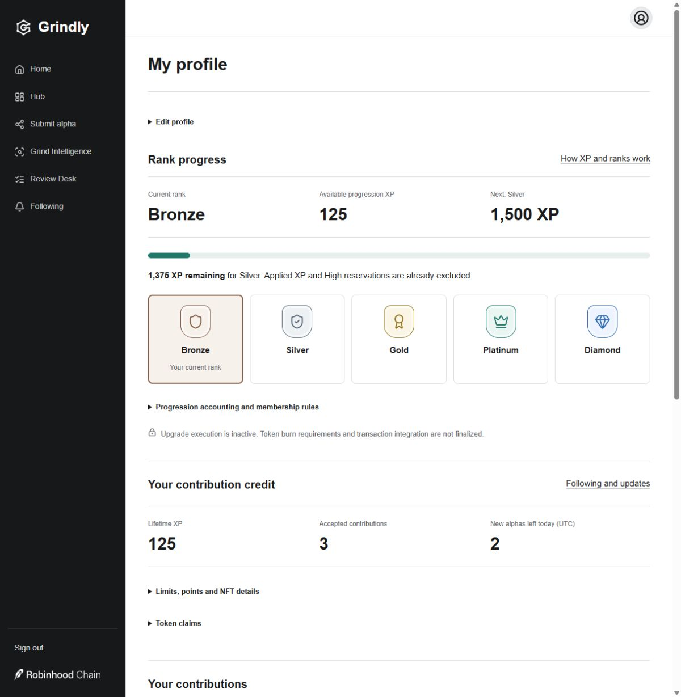

## Following
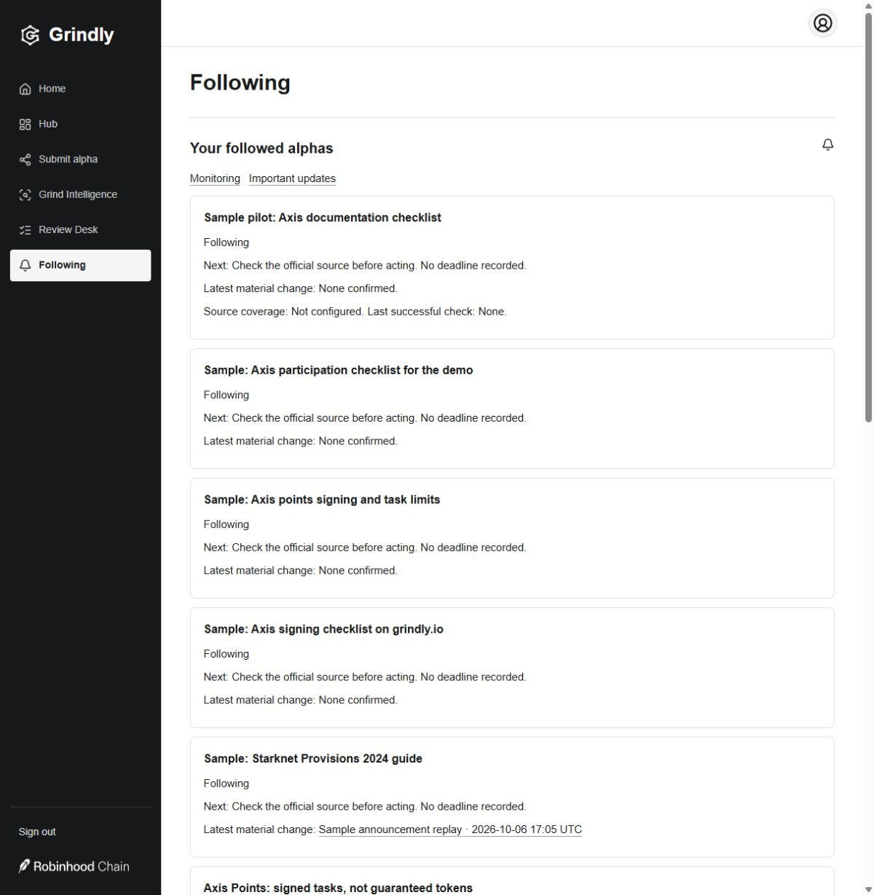

## Monitoring and alerts
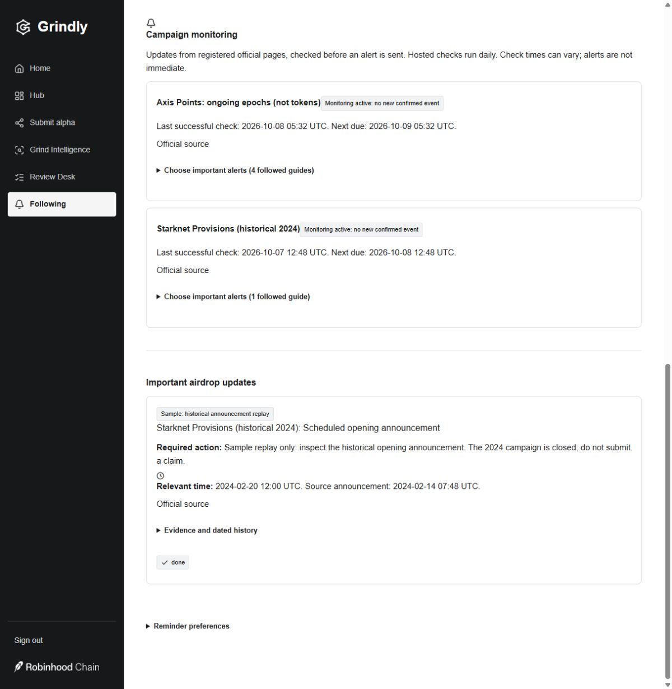

## Mobile
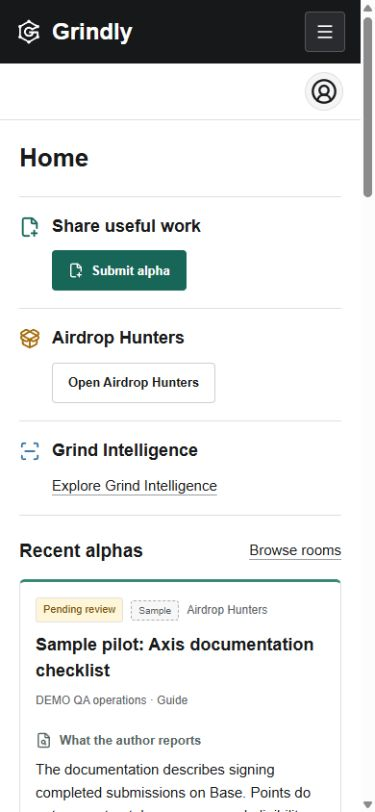
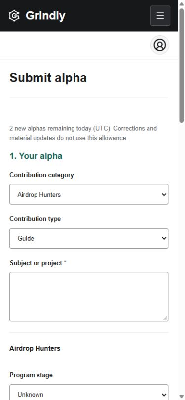

The `desktop-*.png` and `mobile-*.png` files are earlier localhost test captures,
before the last spacing and shortcut refinements. `before-submit.jpg` records the
earlier submission form. See [verification and boundaries](../pilot-readiness.md).
